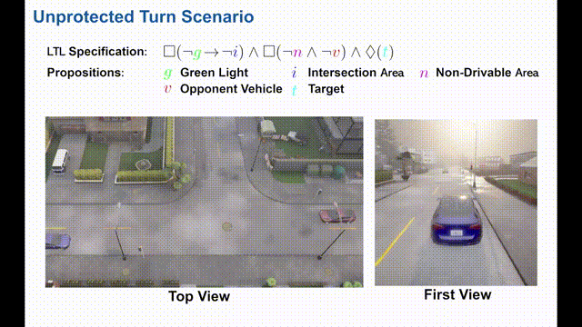
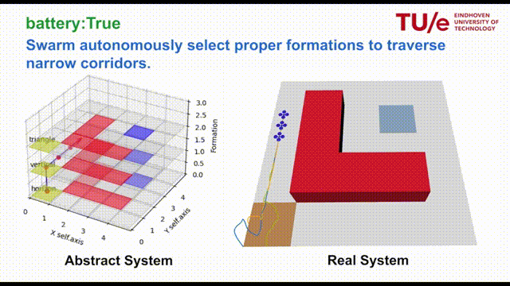
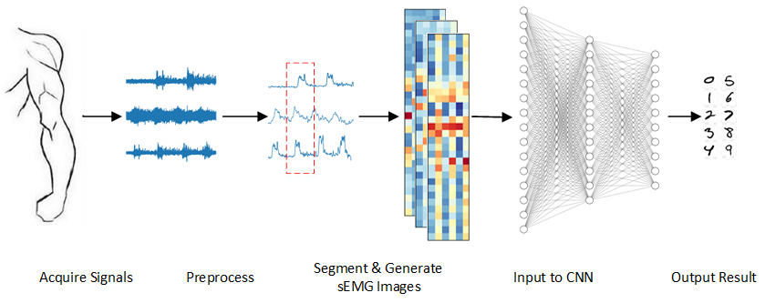

I am a PhD candidate in the control system group at TU Eindhoven, focusing on **trustworthy decision-making and motion control**. Specifically, my research integrates temporal logic planning with safety-critical control to manage uncertainty and resolve deadlock in multi-agent interactions. The theoretical foundations of my work span control theory, game theory, formal methods, and reinforcement learning, and the application domains include autonomous driving and aerospace systems. I also have hands-on experience with a range of robotic platforms, including autonomous vehicles, legged robots, and rehabilitation robots.

## Experience

- **[Sep 2022 - Present] Eindhoven University of Technology**
   
  PhD Student in [Control System group](https://www.tue.nl/en/research/research-groups/control-systems)
  

- **[Oct 2021 - Apr 2022] [Shanghai AI Lab](https://www.shlab.org.cn/)**
   
  Research Intern on Reinforcement Learning for Autonomous Driving
   

- **[May 2020 - Jul 2021] Southern University of Science and Technology**
   
  Research Assistant in [CLEAR Lab](https://www.wzhanglab.site/),on Motion Control of Legged Robot 
   

- **[Sep 2017 - Jan 2020] Beihang University**
   
  M.Eng. in Control Science and Engineering 
    
  - Thesis: sEMG-based Extraction of Motion Intention and Assist-As-Needed Control of Rehabilitation Robot

- **[Sep 2013 - Jul 2017] University of Electronic Science and Technology of China**
   
  B.Eng. in Mechanical and Automation Engineering
   
  - GPA: 3.78/4.00, Rank: 5%
  - Thesis: Iterative Closest Point for Laser-based SLAM
  

## Publications

- **Risk-Aware Autonomous Driving with Linear Temporal Logic Specifications**
   
  **Shuhao Qi**, Zengjie Zhang, Zhiyong Sun, Sofie Haesaert
    IEEE/RSJ International Conference on Intelligent Robots and Systems (IROS), 2025.
  [[Video](https://www.youtube.com/watch?v=r5kEMW8oPQE)][[PDF](https://arxiv.org/abs/2409.09769)]
    

  

- **Integrating Opinion Dynamics into Safety Control for Decentralized Airplane Encounter Resolution**
   
  **Shuhao Qi**, Zhiqi Tang, Zhiyong Sun, Sofie Haesaert
    IEEE/RSJ International Conference on Intelligent Robots and Systems (IROS), 2025.
  [[Video](https://www.youtube.com/watch?v=7TjrVCJQswM)][[PDF](https://arxiv.org/abs/2508.00156)]

- **Avoiding deadlocks is not enough: Analysis and resolution of blocked airplanes**
   
  **Shuhao Qi**, Zengjie Zhang, Zhiyong Sun, Sofie Haesaert
    https://arxiv.org/abs/2411.16911, 2024.
  [[Video](https://www.youtube.com/watch?v=r8v7qULA3fM)][[PDF](https://arxiv.org/abs/2411.16911)]

- **Automated formation control synthesis from temporal logic specifications**
   
  **Shuhao Qi\***, Zengjie Zhang\*, Sofie Haesaert, Zhiyong Sun
    IEEE Conference on Decision and Control (CDC), 2023.
  [[Video](https://www.youtube.com/watch?v=r1aecBOeDq0)] [[PDF](https://ieeexplore.ieee.org/abstract/document/10383729?casa_token=X6Kgx5bUxm8AAAAA:LblvdfAoAX6hGA-odUvLe7uxMo7v2bq2ZlvsYBSKayr1agWOK1GcDpBy_vh86CkVvfc3Hq7QvA)]
    

  

- **Perceptive autonomous stair climbing for quadrupedal robots**
   
  **Shuhao Qi\***, Wenchun Lin\*, Zejun Hong, Hua Chen, Wei Zhang
    IEEE/RSJ International Conference on Intelligent Robots and Systems (IROS), 2021.
  [[Video](https://youtu.be/AlnmMoJFpc4)]
  

  

- **sEMG-based recognition of composite motion with convolutional neural networks**
   
  **Shuhao Qi**, Xingming Wu, Weihai Chen, Jianbin Zhang, Jianhua Wang
   
  Sensors and Actuators, A: Physical (Q1, IF=2.904), 2020.
  [[PDF](./assets/pdf/2020sEMG.pdf)]
  

  

- **Recognition of composite motions based on sEMG via deep learning**
   
  **Shuhao Qi**, Xingming Wu, Jianhua Wang, Jianbin Zhang
   S
  14th IEEE Conference on Industrial Electronics and Applications (ICIEA), 2019. [[Slides](./assets/pdf/ICIEA.pdf)] 
   
 
- **Damping vibration analysis of a dual-axis precision force sensor based on passive eddy current**
   
  Xiantao Sun, Wenjie Chen, Weihai Chen, **Shuhao Qi**, Jun Jiang, Cungang Hu, Jun Tao
   
  Journal of Physics D: Applied Physics, 2020.
   
 
- **Design and analysis of a large-range precision micromanipulator**
   
  Xiantao Sun, Wenjie Chen, Weihai Chen, **Shuhao Qi**, Wang Li, Cungang Hu, Jun Tao
   
  Smart Materials and Structures, 2020.
   
  
## Awards
- **[Jun 2019]** Best Paper Finalist Certificate of ICIEA2019
- **[Jun 2017]** Outstanding Graduate of UESTC
- **[Jul 2015]** National First Prize & Best Technology Award of RoboMasters
  
  
## Services
- Invited Reviewer for CDC, IROS, ICRA, L4DC and TRO, etc.

