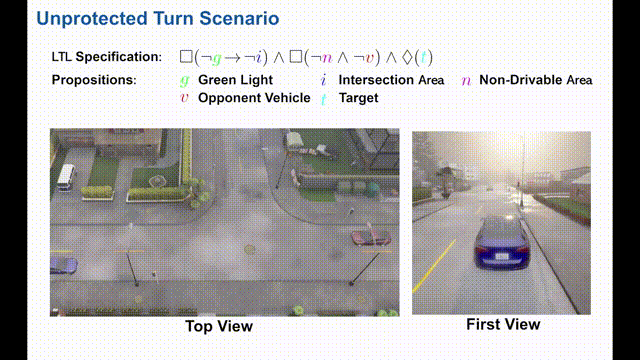
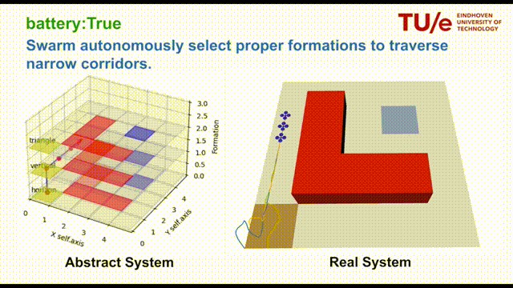
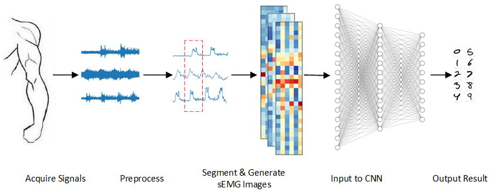

<section class="homepage-intro" id="about">
  <h2>About</h2>
  

    I am a PhD candidate in the Control Systems group at TU Eindhoven, focusing on
    <strong>trustworthy decision-making and motion control</strong>. My research integrates temporal
    logic planning with safety-critical control to manage uncertainty and resolve deadlock in
    multi-agent interactions. I work at the intersection of
    <strong>control theory, game theory, formal methods, and reinforcement learning</strong>, with
    applications in autonomous driving and aerospace systems.
  

</section>

<section class="cv-section" id="experience">
  <h2>Experience</h2>
  

    <article class="cv-item">
      
Sep 2022 - Present

      

        <h3>PhD Student, Eindhoven University of Technology</h3>
        
Control Systems Group, TU Eindhoven.

      

    </article>

    <article class="cv-item">
      
Oct 2021 - Apr 2022

      

        <h3>Research Intern, Shanghai AI Lab</h3>
        
Reinforcement learning for autonomous driving.

      

    </article>

    <article class="cv-item">
      
May 2020 - Jul 2021

      

        <h3>Research Assistant, Southern University of Science and Technology</h3>
        
CLEAR Lab, motion control of legged robots.

      

    </article>

    <article class="cv-item">
      
Sep 2017 - Jan 2020

      

        <h3>M.Eng., Beihang University</h3>
        
Control Science and Engineering. Thesis on sEMG-based intention extraction and assist-as-needed control for rehabilitation robots.

      

    </article>

    <article class="cv-item">
      
Sep 2013 - Jul 2017

      

        <h3>B.Eng., University of Electronic Science and Technology of China</h3>
        
Mechanical and Automation Engineering. GPA: 3.78/4.00 (Top 5%). Thesis on ICP for laser-based SLAM.

      

    </article>
  

</section>

<section class="cv-section" id="publications">
  <h2>Selected Publications</h2>
  <ul class="pub-list">
    <li class="pub-item">
      <h3>Risk-Aware Autonomous Driving with Linear Temporal Logic Specifications</h3>
      
<strong>Shuhao Qi</strong>, Zengjie Zhang, Zhiyong Sun, Sofie Haesaert. IROS 2025.

      
<a href="https://www.youtube.com/watch?v=r5kEMW8oPQE">Video</a> | <a href="https://arxiv.org/abs/2409.09769">PDF</a>

      
    </li>

    <li class="pub-item">
      <h3>Integrating Opinion Dynamics into Safety Control for Decentralized Airplane Encounter Resolution</h3>
      
<strong>Shuhao Qi</strong>, Zhiqi Tang, Zhiyong Sun, Sofie Haesaert. IROS 2025.

      
<a href="https://www.youtube.com/watch?v=7TjrVCJQswM">Video</a> | <a href="https://arxiv.org/abs/2508.00156">PDF</a>

    </li>

    <li class="pub-item">
      <h3>Avoiding Deadlocks Is Not Enough: Analysis and Resolution of Blocked Airplanes</h3>
      
<strong>Shuhao Qi</strong>, Zengjie Zhang, Zhiyong Sun, Sofie Haesaert. arXiv 2024.

      
<a href="https://www.youtube.com/watch?v=r8v7qULA3fM">Video</a> | <a href="https://arxiv.org/abs/2411.16911">PDF</a>

    </li>

    <li class="pub-item">
      <h3>Automated Formation Control Synthesis from Temporal Logic Specifications</h3>
      
<strong>Shuhao Qi*</strong>, Zengjie Zhang*, Sofie Haesaert, Zhiyong Sun. CDC 2023.

      
<a href="https://www.youtube.com/watch?v=r1aecBOeDq0">Video</a> | <a href="https://ieeexplore.ieee.org/abstract/document/10383729?casa_token=X6Kgx5bUxm8AAAAA:LblvdfAoAX6hGA-odUvLe7uxMo7v2bq2ZlvsYBSKayr1agWOK1GcDpBy_vh86CkVvfc3Hq7QvA">PDF</a>

      
    </li>

    <li class="pub-item">
      <h3>Perceptive Autonomous Stair Climbing for Quadrupedal Robots</h3>
      
<strong>Shuhao Qi*</strong>, Wenchun Lin*, Zejun Hong, Hua Chen, Wei Zhang. IROS 2021.

      
<a href="https://youtu.be/AlnmMoJFpc4">Video</a>

      
    </li>

    <li class="pub-item">
      <h3>sEMG-Based Recognition of Composite Motion with Convolutional Neural Networks</h3>
      
<strong>Shuhao Qi</strong>, Xingming Wu, Weihai Chen, Jianbin Zhang, Jianhua Wang. Sensors and Actuators A: Physical, 2020.

      
<a href="./assets/pdf/2020sEMG.pdf">PDF</a>

      
    </li>

    <li class="pub-item">
      <h3>Recognition of Composite Motions Based on sEMG via Deep Learning</h3>
      
<strong>Shuhao Qi</strong>, Xingming Wu, Jianhua Wang, Jianbin Zhang. ICIEA 2019.

      
<a href="./assets/pdf/ICIEA.pdf">Slides</a>

    </li>

    <li class="pub-item">
      <h3>Damping Vibration Analysis of a Dual-Axis Precision Force Sensor Based on Passive Eddy Current</h3>
      
Xiantao Sun, Wenjie Chen, Weihai Chen, <strong>Shuhao Qi</strong>, Jun Jiang, Cungang Hu, Jun Tao. Journal of Physics D: Applied Physics, 2020.

    </li>

    <li class="pub-item">
      <h3>Design and Analysis of a Large-Range Precision Micromanipulator</h3>
      
Xiantao Sun, Wenjie Chen, Weihai Chen, <strong>Shuhao Qi</strong>, Wang Li, Cungang Hu, Jun Tao. Smart Materials and Structures, 2020.

    </li>
  </ul>
</section>

<section class="cv-section" id="awards">
  <h2>Awards</h2>
  <ul class="inline-list">
    <li>Best Paper Finalist Certificate, ICIEA 2019 (Jun 2019)</li>
    <li>Outstanding Graduate, UESTC (Jun 2017)</li>
    <li>National First Prize and Best Technology Award, RoboMasters (Jul 2015)</li>
  </ul>
</section>

<section class="cv-section" id="services">
  <h2>Services</h2>
  <ul class="inline-list">
    <li>Invited reviewer for CDC, IROS, ICRA, L4DC, TRO, and related venues.</li>
  </ul>
</section>
